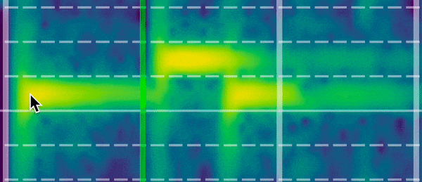
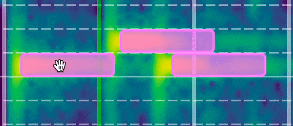
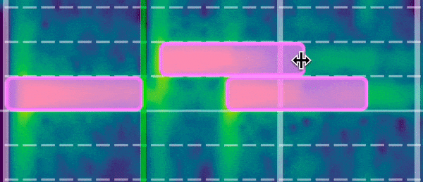

# Creating, Deleting, and Editing Notes

AudiTranscribe supports the creation, deletion, and editing of notes on the transcription view.


You can always undo/redo any of these actions. To see how, look at the
[keyboard shortcuts reference](keyboard-shortcuts.md) document.



All of these actions are only possible if you enter **edit mode**.


## Creating Notes

<figure>
    
    <figcaption>
        
Creating Notes

    </figcaption>
</figure>

Notes can be created on the spectrogram. Simply **left-click** on the spectrogram to place the note rectangle at that
location.

Note rectangles cannot be placed on top of each other. If the to-be-placed note rectangle will collide with another, it
will not be placed at all.

The original size of the note rectangle will the distance between two beat lines (see the white/green lines in the above
GIF). The distance between the lines is determined via the BPM, the time signature, and the offset value.

## Deleting Notes

<figure>
    
    <figcaption>
        
Deleting Notes

    </figcaption>
</figure>

Notes can be deleted from the spectrogram by **right-clicking** on the note rectangle. If there is no rectangle at that
spot then nothing will occur.

## Moving Notes

<figure>
    
    <figcaption>
        
Moving Notes

    </figcaption>
</figure>

* When moving notes is possible, a **hand icon** will be shown.
* Use the **left click** to drag notes around.
* Notes cannot be overlapped.
* Notes can be dragged between note pitches.

## Resizing Notes

<figure>
    
    <figcaption>
        
Resizing Notes

    </figcaption>
</figure>

* When resizing notes is possible, a double-arrow icon will be shown (see above GIF).
* Use the **left click** to resize notes.
* Notes cannot be overlapped.
* Resizing is only possible horizontally.
