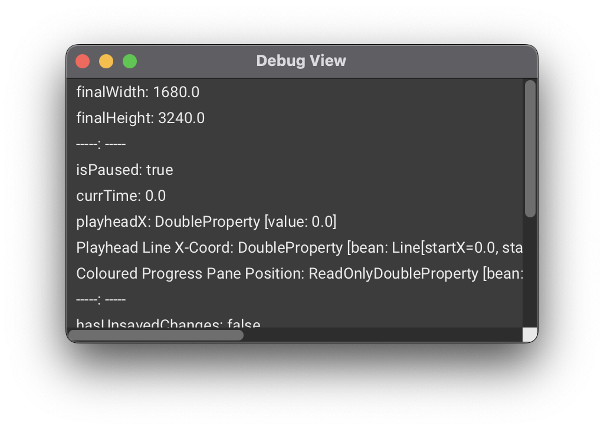

# Debug View


This section is most relevant to contributors of AudiTranscribe, who require this view to perform debugging.


Sometimes, you may want to see the internal state of AudiTranscribe; variables' values and statuses are often hidden
from view, and when debugging seeing these exact values are incredibly useful. This section will explain how to enable
debug mode for AudiTranscribe.

## Enabling Debug Mode

Before you can see the debug view in a project, you have to enable debug mode. Here's how to do it:

1. Go to the application data folder of AudiTranscribe. Here's how to get there easily:
    1. From the home page, click on the gear icon (⚙️) on the lower left-hand corner of
       the screen.
    2. Navigate to the "Input/Output" tab.
    3. Under "Application Data Folder", click "Open Folder".

2. In the application data folder, create a file named `debug-mode.txt` (with the extension `.txt`).
    * The file does not need to contain anything.

Now, when you open any project, debug mode will be enabled.

## Seeing the Debug View

When the debug mode is enabled, you are able to see the debug view. Press **Ctrl + Shift + D** (or, if you are on a mac,
**⌘ + Shift + D**) to open up the debug view.

<figure><figcaption>
The Debug View
</figcaption></figure>

The debug view is a small popup that contains variables' values. You can resize and drag the window around to your
liking.
