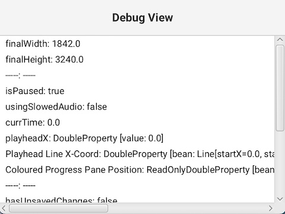

# Debug View


This section is most relevant to developers who are working on AudiTranscribe.


Sometimes, you may want to see the internal state of AudiTranscribe; variables' values and statuses are often hidden
from view, and when debugging seeing these exact values are incredibly useful. This section will explain how to enable
debug mode for AudiTranscribe.

## Enabling Debug Mode

Before you can see the debug view in a project, you have to enable debug mode. Here's how to do it:

1. Go to the application data folder of AudiTranscribe.
    * An easy way to get there is to open the preferences page and click on "Open Data Folder" under the "Miscellaneous"
      tab.
2. In the application data folder, create a file named `debug-mode.txt` (with the extension `.txt`). The file does not
   need to contain anything.
3. Close the application data folder.

Now, when you open any project, debug mode will be enabled.

## Seeing the Debug View

When the debug mode is enabled, you are able to see the debug view. Press **Ctrl + Shift + D** (or, if you are on a
mac, **⌘ + Shift + D**) to open up the debug view.

<figure>
   
   <figcaption>
      
The Debug View

   </figcaption>
</figure>

The debug view is a small popup that contains variables' values. You can resize and drag the window around to your
liking.
