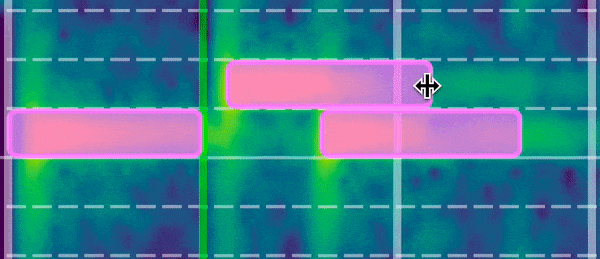

# Note Operations

AudiTranscribe supports several note operations, which can be performed whilst in edit mode during transcription. These
are:

* [#creating-notes](note-operations.md#creating-notes "mention")
* [#deleting-notes](note-operations.md#deleting-notes "mention")
* [#moving-notes](note-operations.md#moving-notes "mention")
* [#resizing-notes](note-operations.md#resizing-notes "mention")
* [#quantizing-notes](note-operations.md#quantizing-notes "mention")


You can always undo/redo any of these operations. To see how, look at
the [keyboard-shortcuts.md](keyboard-shortcuts.md "mention") reference page.



All of these operations are only possible if you enter **edit mode**.


## Creating Notes

<figure><figcaption>
Creating Notes
</figcaption></figure>

Notes can be created on the spectrogram. Simply **left-click** on the spectrogram to place the note rectangle at that
location.

Note rectangles cannot be placed on top of each other. If the to-be-placed note rectangle will collide with another, it
will not be placed at all.

The original size of the note rectangle will the distance between two beat lines (see the white/green lines in the above
GIF). The distance between the lines is determined via the BPM, the time signature, and the offset value.

## Deleting Notes

<figure><figcaption>
Deleting Notes
</figcaption></figure>

Notes can be deleted from the spectrogram by **right-clicking** on the note rectangle. If there is no rectangle at that
spot then nothing will occur.

## Moving Notes

<figure><figcaption>
Moving Notes
</figcaption></figure>

* When moving notes is possible, a **hand icon** will be shown.
* Use the **left click** to drag notes around.
* Notes cannot be overlapped.
* Notes can be dragged between note pitches.

## Resizing Notes

<figure><figcaption>
Resizing Notes
</figcaption></figure>

* When resizing notes is possible, a double-arrow icon will be shown (see above GIF).
* Use the **left click** to resize notes.
* Notes cannot be overlapped.
* Resizing is only possible horizontally.

## Quantizing Notes

In AudiTranscribe, quantizing means moving the transcribed notes in line with the _grid_, which makes an imprecise
transcription end up perfect.

To quantize notes, navigate to the menu and select **Edit > Quantize Notes**. By default, this will align all the notes
to the nearest 32nd note.

To adjust the quantization amount, go to the settings page and navigate to this tab:

<figure><figcaption>
Where to find the note quantization option
</figcaption></figure>

Under "Notes", adjust the note quantization unit to your desired note unit.
