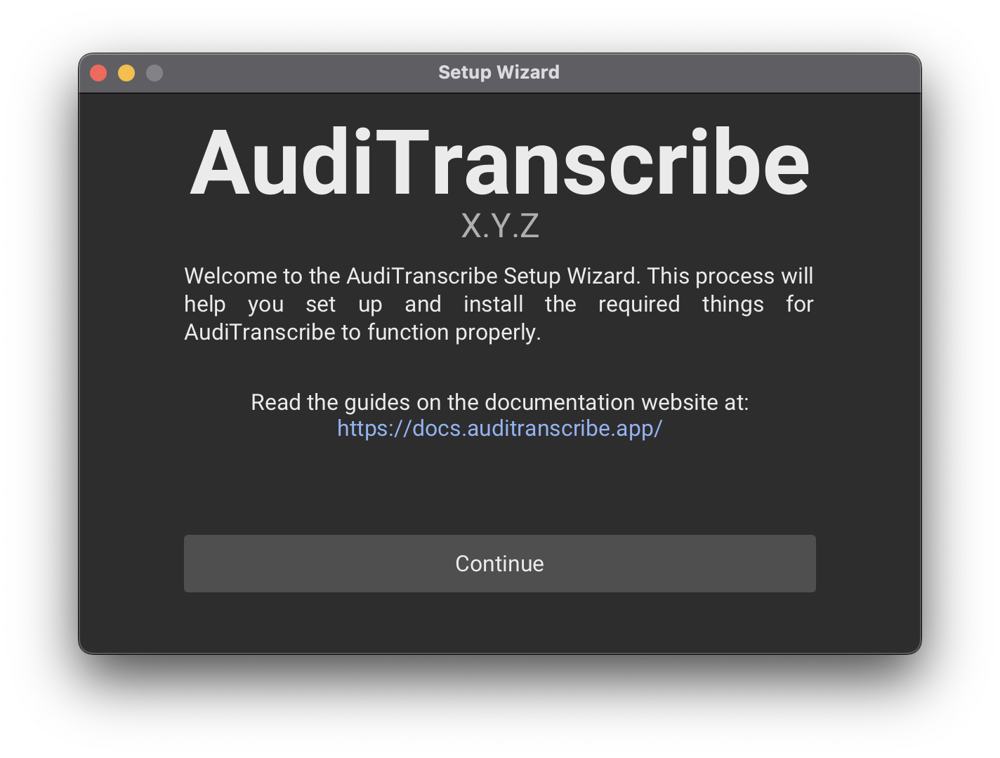

# Setup Wizard

This guide will go through the setup process of AudiTranscribe.

AudiTranscribe will show a setup wizard and install additional components in this step. The setup process may seem a
little complicated at first glance; but follow this guide, and you'll have it installed in no time!


Click on an image to enlarge it!


Launch AudiTranscribe and let's begin!

1. When AudiTranscribe is launched for the first time, this screen will be shown.\
   \
   Click "Continue" to move on to the next step.
2. A prompt asking you to choose a theme for the application will be shown.\
   \
   Choose a theme from the dropdown, then click "Set Theme".
3. Now a prompt asking whether FFmpeg is installed is shown.\
   
    * If you have **already installed** FFmpeg (for example, by
      using [Homebrew](https://formulae.brew.sh/formula/ffmpeg) on macOS or Linux), click on "Yes" to let AudiTranscribe
      check whether the FFmpeg path is valid. Then,
        * if you **do not see any error**, proceed to **Step 8**.
        * if you **see an error**, proceed to **Step 4**.
    * If you **haven't already installed** FFmpeg, click on "No". Then,
        * if you are on **Windows** or on **macOS**, proceed to **Step 5**;
        * otherwise, proceed to **Step 6**.
4. Failure to locate FFmpeg (either automatically or manually) will result in the following screen show up:\
   \
   You then have a choice to either **manually specify the path** or to **read the installation instructions**.
    * If you prefer to **manually specify the path**, proceed to **Step 7**.
    * Otherwise, proceed to **Step 6**.
5. AudiTranscribe now asks you whether to install FFmpeg automatically or manually.\
   
    * We recommend installing FFmpeg **automatically** as all the required setup processes will be handled by
      AudiTranscribe for you. **If you choose this option, please enable internet access**.
        * If the automatic installation **succeeds**, proceed to **Step 8**.
        * Otherwise, proceed to **Step 4**.
    * If you prefer a manual setup, click on the "Manual Installation" button and proceed to **Step 6**.
6. You will now be shown a series of instructions on how to **manually** install FFmpeg.\
   \
   Note that the installation instructions may have changed. Please refer to **your version of the installation
   instructions**.\
   Once you have installed FFmpeg, click on the "I've Installed FFmpeg" button.
    * If the installation step succeeds, proceed to **Step 8**.
    * Otherwise, you will be redirected to the "FFmpeg Not Found" screen. Refer to **Step 4**.
7. You may manually select the FFmpeg binary on this screen.\
   

    * Click on the file icon (📁) to use file explorer to select the FFmpeg binary.
    * You can also manually specify the path to the FFmpeg binary by typing in the text field.

   Once you have entered the path to the FFmpeg binary (or selected it using the file system), click on "Check FFmpeg
   Path".

    * If the process succeeds, proceed to **Step 8**.
    * Otherwise, proceed to **Step 4**.
8. You have completed the FFmpeg installation process! Click on "Continue To Next Section".
9. You have reached the end of the setup process!

## Next Steps

Congratulations! You have completed the AudiTranscribe setup process. Proceed on with
the [Tutorial](../tutorial/0-overview.md) to start learning the basic functions of AudiTranscribe.
